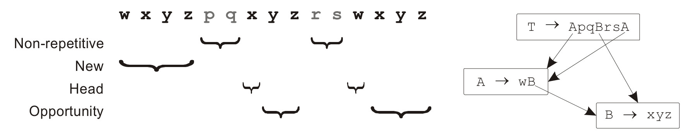

# SequiturAnalysis

[Sequitur](https://github.com/craignm/sequitur) is a hierarchical data compression algorithm that builds a grammar based on the input trace. The production rules of the grammar are formed in a way that captures repetitions in the input. Sequitur repeatedly reads a symbol from the input and extends its grammar accordingly. When a symbol is added, the grammar is adjusted in a way that captures new repetitions caused by the added symbol.

In the context of data stream prediction based on temporal repetitiveness, we can provide an *upper bound* for the prediction opportunity by analyzing Sequitur's produced grammar. The following figure (taken from [Wenisch's Ph.D. thesis on temporal memory streaming](http://citeseerx.ist.psu.edu/viewdoc/download?doi=10.1.1.208.492&rep=rep1&type=pdf)) shows an example of this.



This repo, built on top of Sequitur, analyzes the Sequitur's grammar and calculates the prediction opportunity, along with several relevant statistics (like Figure 7 of [this](http://users.ece.cmu.edu/~ssomogyi/publ/isca2009.pdf)). Moreover, it provides the breakdown of data streams lengths (like Figure 12 of [this](http://cs.ipm.ac.ir/~plotfi/papers/domino_hpca18.pdf)).

### Usage
1. Compile the Sequitur project.

    ```
    $ cd sequitur/c++
    $ make
    $ cd ../..
    ```

2. Put your trace files into `Traces`. Two examples of trace files are provided in `Traces`.

3. Run the script to analyze all traces.

    ```
    $ ./run_all.sh
    ```
